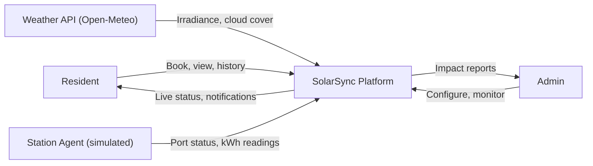
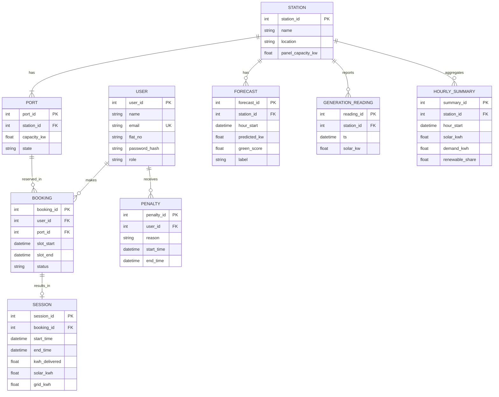
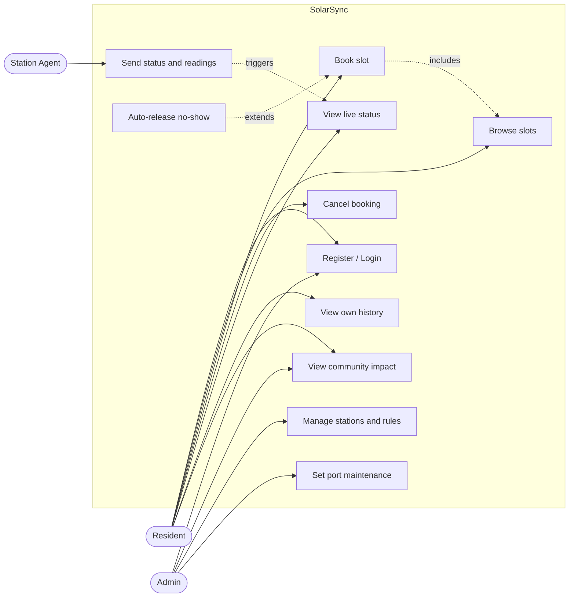
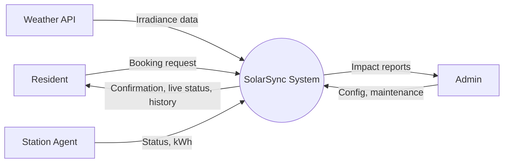
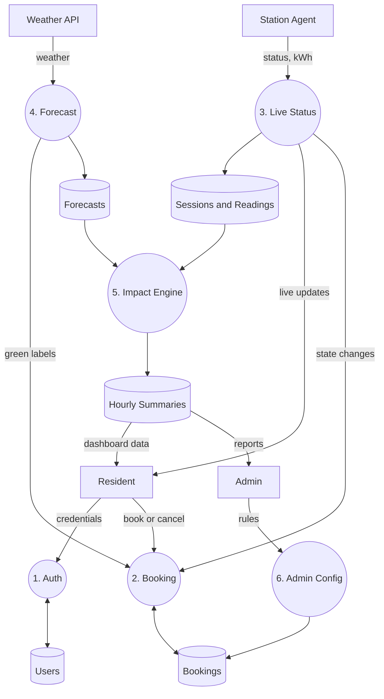
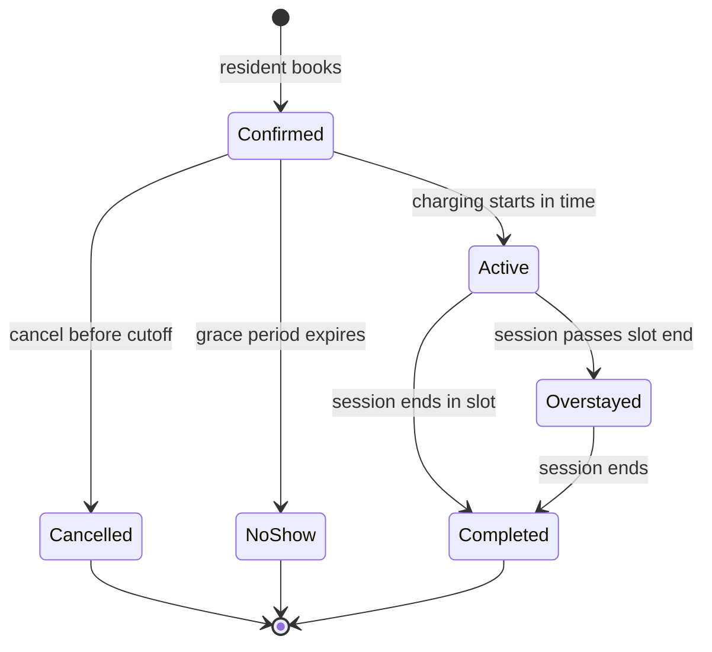
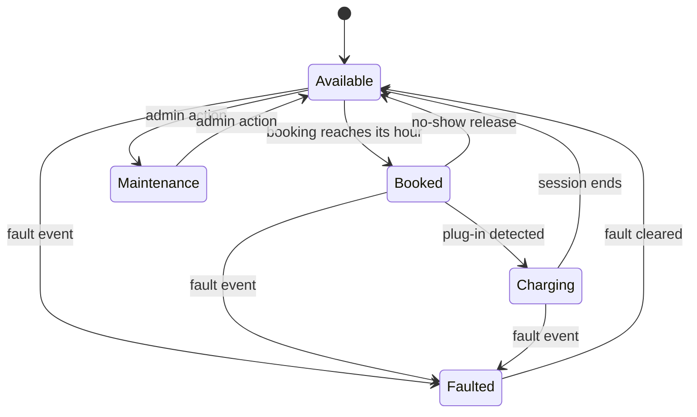
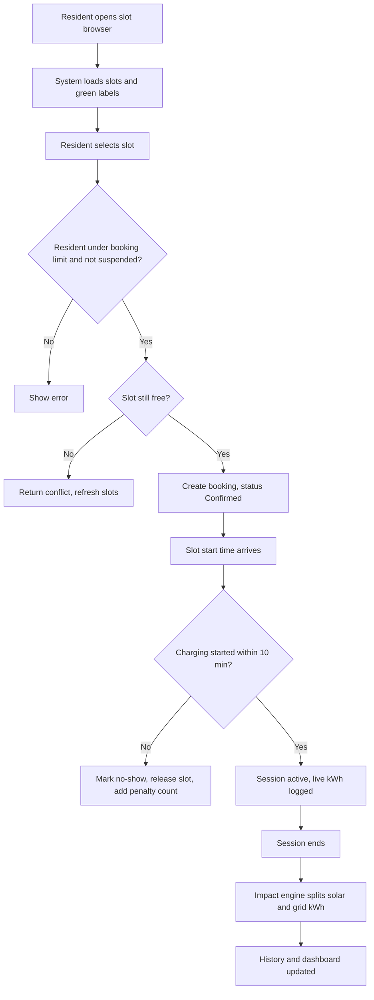

# Software Requirements Specification (SRS)

**Project:** SolarSync: Community Solar-Charging Slot Booking & Renewable Utilization Platform
**SDG Alignment:** UN SDG Target 7.2 (Increase the share of renewable energy)
**Version:** 1.0
**Date:** October 2026
**Prepared by:** 
**Standard followed:** IEEE 830 / ISO/IEC/IEEE 29148 (tailored)

---

## Table of Contents
1. Introduction
2. Overall Description
3. Functional Requirements
4. External Interface Requirements
5. Non-Functional Requirements
6. Data Requirements
7. System Models
8. Renewable Share Calculation (Formal Definition)
9. Test Cases
10. Requirements Traceability Matrix
11. Appendix

---

## 1. Introduction

### 1.1 Purpose
This document specifies the software requirements for SolarSync. It describes what the system must do, the constraints it works under, and how each requirement can be verified. It is written for developers, testers, evaluators and the project guide.

### 1.2 Scope
SolarSync lets residents of a community book shared solar-charging slots, view live slot availability, and view their usage history. The system forecasts solar generation, ranks slots by how green they are, and measures how much of the delivered energy was solar, so the community can report its renewable share and CO2 avoided.

**In scope:** web application, booking engine, live status, solar forecast, usage history, impact dashboard, admin configuration, simulated station agent.
**Out of scope:** physical hardware integration, payments and billing, grid export or energy trading, multi-community federation.

### 1.3 Definitions, Acronyms and Abbreviations

| Term | Meaning |
|---|---|
| Station | A solar charging hub with one or more ports |
| Port | A single charging point at a station |
| Slot | A fixed time window (default 60 min) on one port |
| Booking | A resident's reservation of one slot |
| Session | The actual charging event that happens during a booking |
| Green score | Predicted solar output for a slot hour relative to station capacity (0 to 1) |
| Renewable share | Fraction of energy delivered in an hour that came from solar (Section 8) |
| No-show | A booking where charging did not start within the grace period |
| Overstay | A session that continues past the slot end time |
| Station agent | Software that reports port status and kWh readings (simulated in this project) |
| SRS | Software Requirements Specification |
| JWT | JSON Web Token |
| FR / NFR | Functional / Non-Functional Requirement |

### 1.4 References
1. Project Synopsis, SolarSync (this project).
2. IEEE Std 830-1998, Recommended Practice for Software Requirements Specifications.
3. ISO/IEC/IEEE 29148:2018, Requirements engineering.
4. United Nations, Sustainable Development Goal 7, Target 7.2.
5. Open-Meteo API documentation (weather and solar radiation).
6. NASA POWER Project documentation (historical irradiance).

### 1.5 Document Overview
Section 2 gives the big picture. Section 3 lists numbered functional requirements. Sections 4 to 6 cover interfaces, quality attributes and data. Section 7 has diagrams. Section 8 fixes the formula used for impact measurement. Sections 9 and 10 link every objective to requirements and tests.

---

## 2. Overall Description

### 2.1 Product Perspective
SolarSync is a standalone web platform. It depends on two outside inputs: a weather API for forecast data and station agents for live port data. In this project the station agents are simulated.



### 2.2 Product Functions (Summary)
- Account registration and login with roles
- Slot browsing and booking with no double booking
- No-show auto-release and penalties
- Live port status on a dashboard
- Hourly solar forecast and green ranking of slots
- Per-user and per-station usage history
- Renewable share and CO2 avoided reporting
- Admin configuration of stations and rules
- Optional: fair allocation of high-demand green slots

### 2.3 User Classes

| User | Description | Technical skill |
|---|---|---|
| Resident | Books slots, views status and history | Low |
| Admin | Manages stations, rules, views community impact | Medium |
| Station agent | Machine actor, sends status and readings | Not applicable |

### 2.4 Operating Environment
- Server: Linux, Docker and Docker Compose
- Backend: Rust service and Python forecast service
- Database: PostgreSQL 15 or later
- Client: latest Chrome, Firefox, Edge; mobile browsers with width of 360 px and above

### 2.5 Design and Implementation Constraints
- Station hardware is simulated, so all "live" readings are generated data.
- Forecast data comes from a free public API with rate limits.
- All timestamps are stored in UTC and shown in IST.
- The system must run with one command on a laptop for demonstration.

### 2.6 Assumptions and Dependencies
- Internet access is available for the weather API (a fallback exists, see FR-21).
- Each port serves one booking at a time.
- Residents have a smartphone or computer with a browser.
- The simulated solar generation follows a daylight curve modulated by real cloud cover data.

---

## 3. Functional Requirements

Priority: **M** = Must, **S** = Should, **O** = Optional.

### 3.1 Authentication and Roles

| ID | Requirement | Priority |
|---|---|---|
| FR-1 | A resident shall register with name, email, flat number and password. Email must be unique. | M |
| FR-2 | The system shall log in a user and issue a JWT that expires after 60 minutes. | M |
| FR-3 | The system shall support two roles, resident and admin, and restrict admin functions to admins. | M |
| FR-4 | Passwords shall be stored only as salted hashes (Argon2). | M |

### 3.2 Booking

| ID | Requirement | Priority |
|---|---|---|
| FR-5 | The system shall list stations, their ports and slot availability for a chosen date. | M |
| FR-6 | A resident shall book one slot on one port. Slot length is configurable (default 60 min). | M |
| FR-7 | The system shall reject a booking for a slot that is already booked and return a conflict error, even under concurrent requests. | M |
| FR-8 | A resident shall have at most N active future bookings (default N = 2). | M |
| FR-9 | A resident shall cancel a booking up to 15 minutes before its start, and the slot shall return to the pool. | M |
| FR-10 | If charging has not started within 10 minutes of slot start (grace period), the system shall mark the booking as no-show and release the slot. | M |
| FR-11 | If a resident has 3 no-shows in 30 days, the system shall block new bookings for that resident for 7 days. | S |
| FR-12 | If a session continues past slot end, the system shall flag it as an overstay and notify the resident. | S |

### 3.3 Live Slot Status

| ID | Requirement | Priority |
|---|---|---|
| FR-13 | Each port shall always be in exactly one state: available, booked, charging, faulted or maintenance. | M |
| FR-14 | The station agent shall send port state changes immediately and kWh readings every 5 seconds during a session. | M |
| FR-15 | The dashboard shall show live port states and update through WebSocket without page refresh. | M |
| FR-16 | When a port becomes faulted, the system shall cancel its upcoming bookings for the next 24 hours and notify affected residents. | S |

### 3.4 Solar Forecast and Green Ranking

| ID | Requirement | Priority |
|---|---|---|
| FR-17 | The forecast service shall fetch hourly irradiance and cloud cover for the next 24 hours at least once every 60 minutes. | M |
| FR-18 | The forecast service shall predict hourly solar output (kW) for each station for the next 24 hours. | M |
| FR-19 | The system shall assign each future slot a green score and label (see below). | M |
| FR-20 | The slot list shall show High green slots first by default, with an option to sort by time. | M |
| FR-21 | If the weather API is unreachable, the system shall use the last cached forecast, or an hourly average from historical data, and label the forecast as "estimated". | S |

**Green score definition:**
`G = min(1, predicted solar kW for the hour / total port capacity kW of the station)`

| Label | Condition |
|---|---|
| High | G >= 0.7 |
| Medium | 0.3 <= G < 0.7 |
| Low | G < 0.3 |

### 3.5 Usage History

| ID | Requirement | Priority |
|---|---|---|
| FR-22 | The system shall record every session with user, port, start time, end time and energy delivered (kWh). | M |
| FR-23 | A resident shall view their own history, filter it by date range, and export it as CSV. | M |
| FR-24 | An admin shall view history per station and per port. | M |

### 3.6 Impact Measurement

| ID | Requirement | Priority |
|---|---|---|
| FR-25 | The system shall compute the hourly renewable share for each station using the formula in Section 8. | M |
| FR-26 | The system shall split each session's energy into solar kWh and grid kWh. | M |
| FR-27 | The system shall compute CO2 avoided using a configurable grid emission factor. | M |
| FR-28 | The community dashboard shall show daily, weekly and monthly renewable share, total solar kWh, CO2 avoided and green-slot utilization. | M |
| FR-29 | A resident shall see their own solar share and CO2 avoided. | S |

### 3.7 Fair Allocation (Optional)

| ID | Requirement | Priority |
|---|---|---|
| FR-30 | High green slots shall open for booking 24 hours ahead. If several residents request the same slot in the same 10-minute opening window, the resident with fewer High green bookings in the last 14 days gets it. | O |

### 3.8 Administration

| ID | Requirement | Priority |
|---|---|---|
| FR-31 | An admin shall create and edit stations and ports, including capacity in kW. | M |
| FR-32 | An admin shall configure slot length, grace period, booking limit, penalty rule and emission factor. | M |
| FR-33 | An admin shall put a port into maintenance, which blocks new bookings on it. | M |

---

## 4. External Interface Requirements

### 4.1 User Interface
| Screen | Users | Contents |
|---|---|---|
| Login / Register | All | Forms with validation |
| Slot Browser | Resident | Date picker, stations, slots with green label, book button |
| Live Dashboard | Resident, Admin | Port cards with live state and current kW |
| My Bookings | Resident | Upcoming, past, cancel button |
| My History | Resident | Session table, filters, CSV export, personal solar share |
| Community Impact | All | Charts of renewable share, solar kWh, CO2 avoided |
| Admin Console | Admin | Stations, ports, rules, maintenance toggle, per-station history |

### 4.2 Software Interfaces

**REST API (JSON over HTTPS)**

| Method | Endpoint | Purpose |
|---|---|---|
| POST | /api/auth/register | Create account |
| POST | /api/auth/login | Get JWT |
| GET | /api/stations | List stations and ports |
| GET | /api/slots?station=&date= | Slots with status and green label |
| POST | /api/bookings | Create booking |
| DELETE | /api/bookings/{id} | Cancel booking |
| GET | /api/me/history | Own sessions |
| GET | /api/impact?range= | Community impact data |
| GET | /api/admin/history | Per-station history (admin) |
| PUT | /api/admin/config | Update rules (admin) |

**WebSocket:** `/ws/status` pushes port state and live kW events to the dashboard.

**Station agent protocol:** JSON messages sent to the platform.
```json
{ "station_id": "S1", "port_id": "P2", "state": "charging",
  "kwh_total": 3.42, "power_kw": 6.8, "solar_kw_station": 18.5,
  "timestamp": "2026-10-10T06:15:05Z" }
```

**Weather API:** Open-Meteo, hourly shortwave radiation and cloud cover, no API key.

### 4.3 Hardware Interfaces
None in this version. The station agent is a software simulator.

### 4.4 Communication Interfaces
HTTPS for REST, WSS for WebSocket, TCP for PostgreSQL inside the Docker network.

---

## 5. Non-Functional Requirements

| ID | Category | Requirement | How to verify |
|---|---|---|---|
| NFR-1 | Performance | 95% of live status events reach the dashboard within 2 seconds. | Timestamp comparison over 500 events |
| NFR-2 | Performance | 95% of API calls respond within 500 ms with 100 concurrent users. | Load test |
| NFR-3 | Correctness | With 50 concurrent requests for the same slot, exactly 1 succeeds and 49 get a conflict error. | Concurrency test |
| NFR-4 | Security | Passwords hashed with Argon2, all traffic over HTTPS, JWT expiry enforced, all inputs validated. | Code review, security checklist |
| NFR-5 | Security | Residents cannot read other residents' history. | Authorization test |
| NFR-6 | Reliability | 99% uptime during the demo and test period. | Monitoring log |
| NFR-7 | Scalability | Supports at least 10 stations, 50 ports and 500 residents. | Seeded data load test |
| NFR-8 | Forecast quality | Forecast MAE is at most 20% of station peak output on the test set, reported with the method. | Offline evaluation script |
| NFR-9 | Usability | A first-time user can complete a booking in under 60 seconds. | Usability test with 5 users |
| NFR-10 | Compatibility | Works on latest Chrome, Firefox and Edge, and on a 360 px wide screen. | Manual cross-browser test |
| NFR-11 | Portability | Whole system starts with `docker compose up`. | Fresh machine test |
| NFR-12 | Auditability | Every booking create, cancel, release and penalty is logged with time and actor. | Log inspection |
| NFR-13 | Maintainability | Core modules have unit tests with at least 70% line coverage. | Coverage report |

---

## 6. Data Requirements

### 6.1 Entity Relationship Diagram



### 6.2 Data Dictionary (Key Fields)

| Entity | Field | Type | Rule |
|---|---|---|---|
| USER | email | string | Unique, valid format |
| USER | role | enum | resident or admin |
| PORT | state | enum | available, booked, charging, faulted, maintenance |
| BOOKING | status | enum | confirmed, active, completed, cancelled, no_show |
| BOOKING | (port_id, slot_start) | composite | Unique among confirmed and active bookings, enforces FR-7 |
| SESSION | solar_kwh + grid_kwh | float | Must equal kwh_delivered |
| FORECAST | label | enum | high, medium, low |
| HOURLY_SUMMARY | renewable_share | float | Between 0 and 1 |

### 6.3 Data Retention
Bookings, sessions and summaries are kept for the life of the project. Raw generation readings older than 90 days may be aggregated and deleted.

---

## 7. System Models

### 7.1 Use Case Diagram



### 7.2 Data Flow Diagram, Level 0



### 7.3 Data Flow Diagram, Level 1



### 7.4 State Diagrams

**Booking states**


**Port states**


### 7.5 Booking Workflow



---

## 8. Renewable Share Calculation (Formal Definition)

This section fixes how impact is measured. Forecast data is used only for scheduling. **Accounting uses actual (metered) generation.**

**Symbols for one station and one hour h**
- `S_h` = solar energy generated (kWh), from generation readings
- `D_h` = total energy delivered to all sessions in that hour (kWh)

**Hourly renewable share**
```
R_h = min(1, S_h / D_h)        if D_h > 0
R_h = not defined              if D_h = 0
```

**Session split.** For a session that delivered `E` kWh in hour h:
```
solar_kwh = E x R_h
grid_kwh  = E - solar_kwh
```
If a session spans several hours, apply this per hour and sum.

**Community renewable share over a period**
```
Renewable % = (sum of solar_kwh over all sessions) / (sum of kwh_delivered over all sessions) x 100
```

**CO2 avoided**
```
CO2 avoided (kg) = total solar_kwh x grid emission factor (kg CO2 per kWh)
```
The emission factor is an admin setting. Default is 0.71 kg CO2 per kWh (India grid average). Verify against the latest Central Electricity Authority CO2 baseline database before final submission.

**Green-slot utilization**
```
Green-slot utilization % = (hours booked in High green slots) / (total hours booked) x 100
```

**Baseline comparison (proof of impact).** The dashboard also shows a baseline: the renewable share the same sessions would have had if they were spread evenly across 6 AM to 10 PM, instead of following green ranking. The difference is the improvement attributed to solar-aware scheduling.

---

## 9. Test Cases

| ID | Requirement | Scenario | Expected result |
|---|---|---|---|
| TC-1 | FR-1 | Register with an existing email | Rejected with message |
| TC-2 | FR-2 | Use JWT after 60 minutes | Rejected, login required |
| TC-3 | FR-7, NFR-3 | 50 concurrent bookings for one slot | 1 success, 49 conflict errors |
| TC-4 | FR-8 | Book a third active slot with limit 2 | Rejected |
| TC-5 | FR-9 | Cancel 10 minutes before start | Rejected |
| TC-6 | FR-10 | Do not start charging, wait 10 min | Booking becomes no_show, slot available |
| TC-7 | FR-11 | Three no-shows in 30 days | Bookings blocked for 7 days |
| TC-8 | FR-15, NFR-1 | Change port state in simulator | Dashboard updates in 2 seconds or less |
| TC-9 | FR-16 | Trigger fault on a port with next-day bookings | Bookings cancelled, users notified |
| TC-10 | FR-19 | Forecast of 80% of capacity | Slot labelled High |
| TC-11 | FR-21 | Block weather API | Cached forecast used, marked estimated |
| TC-12 | FR-25, FR-26 | S_h = 10 kWh, D_h = 20 kWh, session E = 4 kWh | R_h = 0.5, solar 2 kWh, grid 2 kWh |
| TC-13 | FR-25 | S_h = 30 kWh, D_h = 20 kWh | R_h capped at 1 |
| TC-14 | FR-27 | 100 solar kWh, factor 0.71 | 71 kg CO2 avoided |
| TC-15 | NFR-5 | Resident A requests resident B's history | Access denied |
| TC-16 | FR-33 | Set port to maintenance | New bookings on it blocked |

---

## 10. Requirements Traceability Matrix

| Synopsis objective | Requirements | Test cases |
|---|---|---|
| O1. Book a slot in advance | FR-5, FR-6, FR-7, FR-8, FR-9 | TC-3, TC-4, TC-5 |
| O2. Live slot status | FR-13, FR-14, FR-15, FR-16 | TC-8, TC-9 |
| O3. Usage history | FR-22, FR-23, FR-24 | TC-15 |
| O4. Solar forecast and green ranking | FR-17, FR-18, FR-19, FR-20, FR-21 | TC-10, TC-11 |
| O5. Renewable share and CO2 tracking | FR-25, FR-26, FR-27, FR-28, FR-29 | TC-12, TC-13, TC-14 |
| O6. Fair allocation | FR-30 | Fairness simulation (optional) |
| O7. No-show and overstay handling | FR-10, FR-11, FR-12 | TC-6, TC-7 |
| Administration | FR-31, FR-32, FR-33 | TC-16 |
| Security and access | FR-1 to FR-4, NFR-4, NFR-5 | TC-1, TC-2, TC-15 |

---

## 11. Appendix

### A. Open Issues
1. Final slot length (30 or 60 min) to be fixed with the guide.
2. Choice of forecast model (rule-based irradiance model or regression) to be fixed after data exploration.
3. Whether fair allocation (FR-30) is built depends on remaining time.

### B. Document Revision History

| Version | Date | Change |
|---|---|---|
| 1.0 | October 2026 | First draft |
